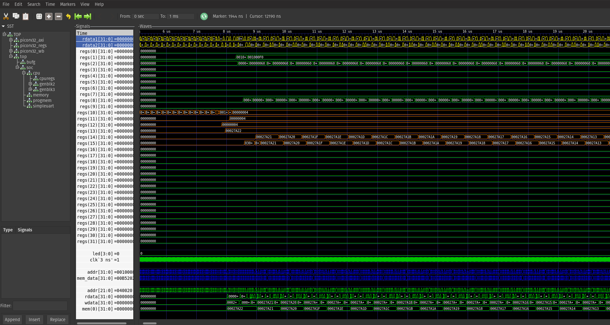

# PicoSOC Step 01
## Introduction
Engineers love a challenge. Ok, some engineers love some challenges.

After getting the "counter_test" example from the symbiflow/xc7 folder running, I wanted to get a RISC-V processor up and running. The Symbiflow examples have a "picosoc_demo" example based on the PicoRV32, and a more advanced "litex_demo" based on VexRiscv and other processors. There is yet another example on the PicoRV32 repository, based on Lattice Dev Kits.

The "picosoc_demo" example works. Unfortunately, there is no information regarding the compiling of the firmware. The firmware is hard coded as memory instructions in one of the files.

The Lattice PicoSOC demo has code, but is based on two different Lattice boards with different SRAM and Flash memory chips.

I did not look into the PicoRV32 implementation on the "litex_demo" folder. I've not yet gone so far as to use Litex, but compiling and testing it works!

The following will attempt to explain, from a user's perspective (a.k.a., me!), how to:
- implement an LED peripheral on the PicoSOC, 
- write a simple C blinky program,
- compile the code for the PicoRV32,
- write the binary firmware code as part of the FPGA,
- simulate the complete SOC (gateware and firmware) using Verilator,
- and finally download it or flash it onto the FPGA

This example relies heavily on the Symbiflow "picosoc_demo" example and on the original PicoRV32 implementation (links below).

## Getting started
Best way to get started is to clone or download this repository and keep the "picosoc_step_01" folder inside the symbiflow-examples/xc7/ structure"
```bash
(xc7) user@user_pc:~/Projects/symbiflow-examples/xc7/picosoc_step_01$ 
```
You may use a different folder structure, but some of the make commands you'd use to build a project are based on the common.mk makefile included in symbiflow-examples/common.

## File list
* [arty_tb.cpp](arty_tb.cpp): Verilator test bench
* [arty.pcf](arty.pcf): Pin description for Arty A7 board for this project
* [arty.v](arty.v): Top module, implements "picosoc_noflash.v" and the GPIOs
* [main.c](main.c): Firmware code. Implements a C blinky counter
* [Makefile](Makefile): Used to construct simulation, firmware and gateware, or delete generated files.
* [picorv32.v](picorv32.v): Actual processor core (taken from [PicoRV32](https://github.com/YosysHQ/picorv32))
* [picosoc_noflash.v](picosoc_noflash.v): Contains the program memory, RAM memory and simple UART (not used)
* [picosoc.sdc](picosoc.sdc): Timing constrains
* [progmem.py](progmem.py): Used to generate "progmem.v" from the binary code after compiling the firmware
* [README.md](README.md): You're looking at it right now
* [sections.lds](sections.lds): Linker file
* [simpleuart.v](simpleuart.v): Uart implementation, not used, but kept for future examples
* [start.s](start.s): Firmware startup code
* [waveform.gtkw](waveform.gtkw): GTK Wave settings for simulation viewing

## Building the project
Building the project is done via makefiles called from the symbiflow-examples/xc7 folder:
```bash
(xc7) user@user_pc:~/Projects/symbiflow-examples/xc7$ 
```
I'm using VS code for convenience, but all commands will work from the terminal. Make sure you're using your 'xc7' environment!

### Building the firmware
Firmware is built using the "riscv64-unknown-elf-gcc" compiler. The flags tell the compiler to compile for 32 bits.
Run the command:
```bash
(xc7) user@user_pc:~/Projects/symbiflow-examples/xc7$ TARGET="arty_100" make -C ./picosoc_step_01/ firmware
```
This invokes from Makefile:
```
firmware: main.elf
    $(CROSS)objcopy -O binary main.elf main.bin
    python progmem.py

main.elf: main.lds start.s main.c
    $(CROSS)gcc $(CFLAGS) -march=rv32im -mabi=ilp32 -Wl,--build-id=none,-Bstatic,-T,main.lds,-Map,main.map,--strip-debug -ffreestanding -nostdlib \
    -o main.elf start.s main.c

main.lds: sections.lds
    $(CROSS)cpp -P -o $@ $^
```
After the firmware compiles successfully, you'll see a new file, "progmem.v". This file contains the program and emulates the flash memory. It is needed to generate the bitstream that goes into the FPGA.

### Simulating the project
I'm not an expert using verilator, far from it, I'm a beginner. I used some of the guides listed below to help me out with simulating. Fortunately the simulation is pretty simple, it only requires a clock input and letting it run for a while. That while depends how long you want to see, but to get an idea, 1ms simulation time at 100MHz clock generates a 72MB trace. In this case the simulation is set to 1 ms. You can change that in line 9 inside the arty_tb.cpp file:
```c
#define MAX_SIM_TIME   0.001f * 1e9 // Simulation time
```
Running the simulation is done in two steps. The first one generates all necessary C++ from the model by calling verilator:
```bash
(xc7) user@user_pc:~/Projects/symbiflow-examples/xc7$ TARGET="arty_100" make -C ./picosoc_step_01/ sim
```
The second step compiles the test bench, runs the simulation and generates a waveform:
```bash
(xc7) user@user_pc:~/Projects/symbiflow-examples/xc7$ TARGET="arty_100" make -C ./picosoc_step_01/ waveform
```

The Makefile code responsible to run the simulation:
```
sim: firmware
	verilator -I./ -Wall --trace -cc ${current_dir}/arty.v $(SOURCES) --exe $(SIM_SOURCES)

waveform:
	make -C ./obj_dir -f Varty.mk Varty
	./obj_dir/Varty
```
I'll not go into details here, there's better documentation out there, but the first step generates an "output_dir" folder with all necessary files, and the second step compiles them all and rund the executable that generates the waveform.

You can open the waveform either calling:
```bash
(xc7) user@user_pc:~/Projects/symbiflow-examples/xc7$ gtkwave ./picosoc_step_01/waveform.vcd
```
Or through GTKWave directly, "Open New Tab… (Ctrl + T)" and selecting "waveform.gtkw". It should look something like below:


You'll notice the LED values do not change running the simulation for only 1 ms, but see how the value of mem(0)[31:0] decreases after a few clock cycles. The LEDs will toggle when that counter reaches 0, and the initial value will be reloaded.

Take some time to look at the simulation, everything that happens inside the processor is for you to see. It is a lot of information, and I have not gotten through it.

You could play around with the optimization flags, -O1, -O2 or -O3. I found that using -O1 decreased the time between delay substractions significantly (~factor 7), but for some reason I have not looked into, -O2 and -O3 acted almost as LED counters without delay.

### Generating the bitstream
#### Gateware generation
This follows the steps from the [Symbiflow examples](https://symbiflow-examples.readthedocs.io/en/latest/). Simply call:
```bash
(xc7) user@user_pc:~/Projects/symbiflow-examples/xc7$ TARGET="arty_100" make -C ./picosoc_step_01/
```
This takes a fair few minutes. 

#### Downloading bitstream
Once it's ready you can download the bitstream into the FPGA temporarily until the next power reset using the default:
```bash
(xc7) user@user_pc:~/Projects/symbiflow-examples/xc7$ TARGET="arty_100" make -C ./picosoc_step_01/ download
```
Alternatively, I added a different command on the project's makefile:
```bash
(xc7) user@user_pc:~/Projects/symbiflow-examples/xc7$ TARGET="arty_100" make -C ./picosoc_step_01/ program
```

#### Persistent programming
If you'd like to permanently flash the FPGA with your bitstream, you need to store it inside the SPI flash chip on the Art-A7 board. First you'll need to get the bscan_spi_bistream to temporarily program the FPGA so it can access the SPI memory (link [here](https://github.com/quartiq/bscan_spi_bitstreams) and below). That then allows OpenOCD to write the bitstream onto flash.
```bash
(xc7) user@user_pc:~/Projects/symbiflow-examples/xc7$ TARGET="arty_100" make -C ./picosoc_step_01/ program
```
This takes close to a minute, and exits. After exiting the SPI has been reprogrammed. Push the "Prog" (top left) on your board and see lights blink! By the way, on my Arty A7 100T it takes 10 seconds to load the program from SPI into FPGA RAM. I had a chat about that with some guys at the Symbiflow Slack channel, but I did not pursue it further after a while…

The Makefile commands related to programming and flashing are below:
```
DIGILENT_CFG_DIR:=~/miniconda3/envs/xc7/share/openocd/scripts/board
BSCAN_DIR:=${current_dir}/../

flash:
	openocd -f ${DIGILENT_CFG_DIR}/digilent_arty.cfg -c 'init; jtagspi_init 0 ${BSCAN_DIR}/bscan_spi_xc7a100t.bit; \
	jtagspi_program {${BOARD_BUILDDIR}/${TOP}.bit} 0x0; exit'

program:
	openocd -f ${DIGILENT_CFG_DIR}/digilent_arty.cfg -c 'init; pld load 0 ${BOARD_BUILDDIR}/${TOP}.bit; exit';
```
### Removing all generated data
To remove bitstream related files:
```bash
(xc7) user@user_pc:~/Projects/symbiflow-examples/xc7$ TARGET="arty_100" make -C ./picosoc_step_01/ clean
```

To remove firmware related files:
```bash
(xc7) user@user_pc:~/Projects/symbiflow-examples/xc7$ TARGET="arty_100" make -C ./picosoc_step_01/ clean_fw
```

To remove simulation related files:
```bash
(xc7) user@user_pc:~/Projects/symbiflow-examples/xc7$ TARGET="arty_100" make -C ./picosoc_step_01/ clean_sim
```

Makefile:
```
clean_fw:
	rm -f main.elf
	rm -f main.lds
	rm -f main.map
	rm -f main.bin
	rm -f progmem.v

clean_sim:
	rm -rf ./obj_dir
	rm -f ./waveform.vcd
```

## Further steps
The following are things that still need to happen and that I will try to get up and running some time, in no particular order and with no particular timeline in mind:
* Implement an additional peripheral, possibly UART
* Implement interrupts
* Check out what happens with -O1, -O2 and -O3
* Being able to store the FW in flash, avoiding the regeneration of the complete bitstream
* Being able to store the FW in flash, but run the program from internal memory
* Implement external RAM, or internal RAM blocks
* Check further examples from Litex
* ...and so on and so forth…

## If you made it this far
Thanks for reading! I hope it's been useful. This is not meant to be a deep insight into the Risc-V workings, but something to get started. It's still a learning process for me, but I hope to explore more given time.

If you find anything wrong, something doesn't work, if you figured out a way to do any of the "Further steps" above I'd like to know about it.
Please use the "Issues" tab in Github to contact me. 

## Useful links and references
- [Symbiflow Website](https://symbiflow.github.io/)
- [Symbiflow Getting Started and Examples installation](https://symbiflow-examples.readthedocs.io/en/latest/)
- [Symbiflow Examples Git Repository](https://github.com/SymbiFlow/symbiflow-examples)
- [The original PicoRV32 Git Repository](https://github.com/YosysHQ/picorv32)
- [Verilator examples](https://www.itsembedded.com/dhd/verilator_1/)
- [Verilator manual (PDF)](https://www.veripool.org/ftp/verilator_doc.pdf)
- [bscan_spi_bitstreams Git Repository - To flash bitstream onto SPI memory](https://github.com/quartiq/bscan_spi_bitstreams)
